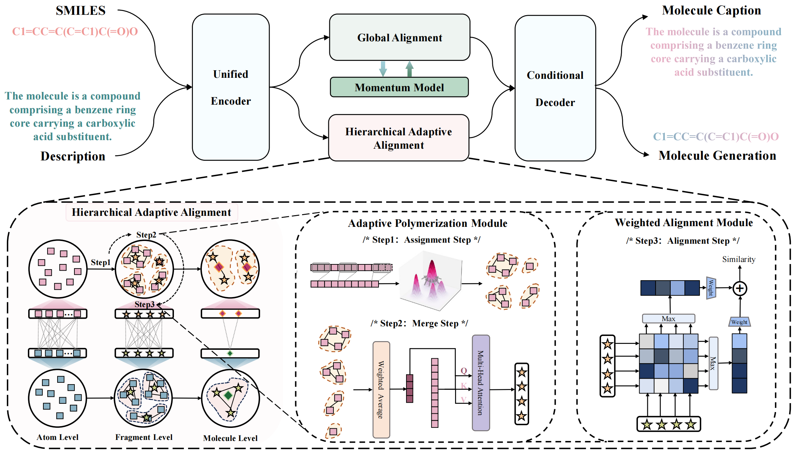

<div align="center">

# 【ICLR 2025】:alembic: Atomas: Hierarchical Adaptive Alignment on Molecule-Text for Unified Molecule Understanding and Generation <br>
[Project Page](atomas.github.io) | [Paper](https://openreview.net/forum?id=mun3bGqdDM&referrer=%5BAuthor%20Console%5D(%2Fgroup%3Fid%3DICLR.cc%2F2025%2FConference%2FAuthors%23your-submissions)) | [Report Bug](https://github.com/yikunpku/Atomas/issues) | [Citation](#Citation)

</div>
<!-- TABLE OF CONTENTS -->
<details open>
  <summary><strong>Table of Contents </strong> </summary>
  <ol>
    <li>
      <a href="#Updates">Updates</a>
    </li>
    <li>
      <a href="#About The Project">About The Project</a>
    </li>
    <li>
      <a href="#Getting Started">Getting Started</a>
      <ul>
        <li><a href="#Requirements">Requirements</a></li>
        <li><a href="#Pre-trained Model">Pre-trained Model</a></li>
        <li><a href="#Training">Training</a></li>
        <li><a href="#Evaluation">Evaluation</a></li>
      </ul>
    </li>
    <li><a href="#Citation">Citation</a></li>
    <li><a href="#Contact">Contact</a></li>
  </ol>
</details>


<div id="Updates">

## 📣 Updates

* **[2025/2/24]**:  We've released the source code and pretrained checkpoint for Atomas. This includes everything needed to start using and extending Atomas in your own projects. Enjoy easy setup and quick integration!

<!-- ABOUT THE PROJECT -->
<div id="About The Project">

## :blue_book: About The Project



We propose **Atomas**, a hierarchical molecular representation learning framework that jointly learns representations from SMILES strings and text. We design a Hierarchical Adaptive Alignment model to automatically learn the fine-grained fragment correspondence between two modalities and align these representations at three semantic levels. 
Atomas's end-to-end training framework supports understanding and generating molecule, enabling a wider range of downstream tasks. Extensive experiments on retrieval and generation tasks demonstrate superior performance, highlighting the efficacy of our method. Scaling experiments reveal Atomas’s robustness and scalability. Additionally, the visualization and qualitative analysis of Atomas confirms the chemical significance of our approach.

<div id="Getting Started">

## :rocket: Getting Started

To get a local copy up and running follow these simple example steps.

<div id="Requirements">

### Requirements

To install requirements:

```setup
pip install -r requirements.txt
```

<div id="Pre-trained Model">

### Pre-trained Model

You can download pretrained models here:

- [Atomas](https://drive.google.com/file/d/1i4v7b4ZdOnOHJ5hWBFENxmdwaPp8HYBW/view?usp=drive_link) pre-trained on PubchemSTM-distill dataset and finetune on CHEBI-20 dataset for molecule generation task. 

<div id="Training">

### Training

To train the model(s) in the paper, run this command:

```train
python main.py --project Atomas --data_dir <your data path> --dataset <choose pubchem or chebi-20 dataset> --model_size <choose base or large> --task <choose genmol or gentext>
```

<div id="Evaluation">

### Evaluation

To evaluate model, run:

```eval
python eval.py --resume_from_checkpoint mymodel.ckpt 

```


<div id="Citation">

## :pushpin: Citation

If you find our work useful in your research or if you use parts of this code please consider citing our paper:

```
@article{zhang2024atomas,
  title={Atomas: Hierarchical alignment on molecule-text for unified molecule understanding and generation},
  author={Zhang, Yikun and Ye, Geyan and Yuan, Chaohao and Han, Bo and Huang, Long-Kai and Yao, Jianhua and Liu, Wei and Rong, Yu},
  journal={arXiv preprint arXiv:2404.16880},
  year={2024}
}
```

<div id="Contact">

<!-- CONTACT -->
## :phone: Contact

Yikun Zhang - yikun.zhang@stu.pku.edu.cn


